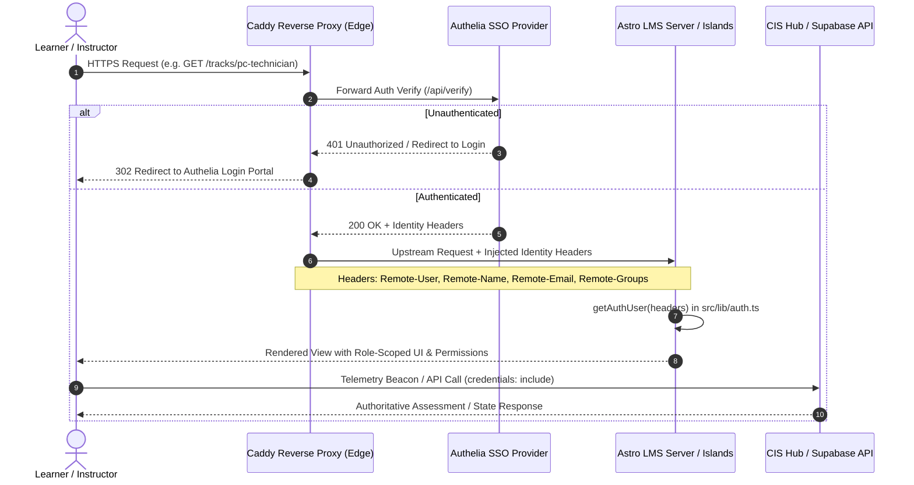
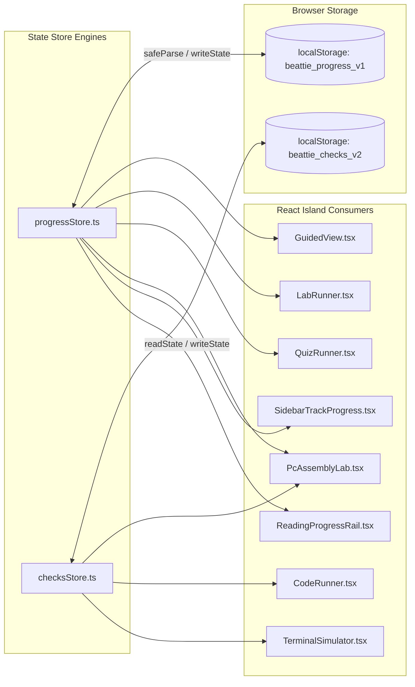
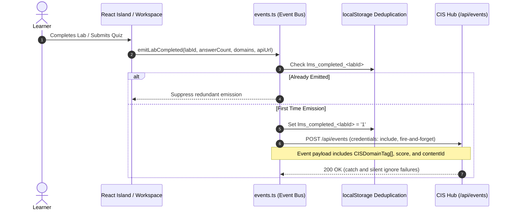

# System Architecture & Scope Specification: BeattieNetTrack LMS

**Document Version:** 1.0.0  
**Target Audience:** Security & Performance Audit Team (Claude Fable / External Auditors)  
**Date:** March 2026  
**Repository:** `mlingschbeattie/beattieNetTrack`  
**Governing Contract:** `CONSTITUTION.md` (LMS Constitution v3)  
**Primary Standards:** CompTIA Tech+ (FC0-U71), A+ (220-1101/1102), Network+ (N10-009), Security+ (SY0-701), Linux+, Python PCEP

---

## 1. Executive Summary & Core Architecture

`beattieNetTrack` is a specialized, high-performance Learning Management System (LMS) engineered for career and technical education (CTE) in cybersecurity, network engineering, systems administration, and software development.

The system is built on a **Static-First Architecture** governed by `CONSTITUTION.md`. Core curriculum content, navigation graphs, and learning hierarchy are generated at build time using **Astro 5 SSG**, while user interactivity, real-time feedback, simulation engines, and state synchronization are handled by isolated **React 18 Component Islands** and sandboxed runtime frames.

```mermaid
graph TD
    subgraph Client Layer (Browser)
        A[Browser Client / Student Viewport]
        B[React 18 Interactive Islands]
        C[Astro 5 SSG Static Engine]
        D[Sandboxed Lab Iframe / Canvas Simulators]
        W[Web Worker Execution Sandbox]
        
        A -->|Hydration Directives: client:load, client:visible| B
        A -->|Static HTML & Zero-JS Layout| C
        A -->|Sandboxed Frame postMessage Bridge| D
        B -->|Blob Web Worker postMessage| W
    end

    subgraph Security & Ingress Boundary
        E[Caddy Reverse Proxy] -->|Forward Auth / TLS Termination| F[Authelia SSO]
        E -->|Inject Identity Headers: Remote-User, Remote-Groups| A
    end

    subgraph Client State & Storage
        G[(localStorage: beattie_progress_v1)]
        H[(localStorage: beattie_checks_v2)]
        PS[progressStore.ts] <--> G
        CS[checksStore.ts] <--> H
        B <--> PS
        B <--> CS
    end

    subgraph Telemetry & Hub Integration
        EB[events.ts Event Bus] -->|Fire-and-Forget POST /api/events| HUB[(CIS Hub Scoring Engine)]
        BC[beacon.ts] -->|Active Heartbeat 30s Pings| HUB
    end

    subgraph Backend & Persistent Services (Roadmap)
        SB[Supabase Edge Functions] -->|LLM Prompt Pipeline| CL[Anthropic Claude API]
        SB -->|PostgreSQL with RLS Policies| DB[(Supabase Cloud DB)]
    end
```

### 1.1 Technology Stack & Invariant Specifications

| Component / Layer | Technology | Specification & Invariant Implementation Details |
|---|---|---|
| **Core SSG Framework** | **Astro 5.17+** | Static Site Generation (SSG) with Node adapter (`@astrojs/node` standalone) for hybrid rendering. Zero client-side router for core learning structure (`CONSTITUTION.md` §1). |
| **Interactive Islands** | **React 18.3+** (`@astrojs/react`) | Hydrated selectively using `client:load`, `client:visible`, or `client:idle`. Used strictly for interactive state engines, never for primary layout structure. |
| **Content Pipeline** | **Astro Content Collections + MDX** (`@astrojs/mdx`) | Strictly validated schemas in `src/content/config.ts` enforcing strict typing for `tracks`, `modules`, `lessons`, `labs`, `quizzes`, and `activities`. |
| **Design System & Styling** | **Vanilla CSS Design Tokens** | Defined in `src/styles/tokens.css` (Enterprise Dark Standard `--beattie-*`) and `src/styles/global.css`. **Tailwind CSS is explicitly forbidden and not bundled.** |
| **Code Execution Engine** | **Web Worker + CodeMirror 6** (`@uiw/react-codemirror`) | In-browser code editing with syntax highlighting and isolated Web Worker JavaScript runtime with 1500ms hard execution timeouts. |
| **Simulators & Labs** | **Native React + Sandboxed Iframe** | High-fidelity drag-and-drop hardware simulators (`PcAssemblyLab.tsx`), mock shells (`TerminalSimulator.tsx`), and sandboxed legacy HTML5/Canvas security modules. |
| **Testing & CI Pipeline** | **Playwright & Node Test Runner** | Multi-layer test gate: track schema validation (`validate-tracks.mjs`), type checking (`astro check`), unit tests (`node --test`), production build, and visual regression tests. |

---

## 2. Authentication, Authorization & Supabase RLS Strategy

### 2.1 Ingress Authentication Flow (Caddy + Authelia)

Authentication is decoupled from the frontend application and enforced at the infrastructure edge via **Caddy Reverse Proxy** integrated with **Authelia SSO** forward authentication.



### 2.2 Identity Extraction Implementation (`src/lib/auth.ts`)

The server-side context and edge handlers extract authenticated identities from injected HTTP headers:

- `Remote-User` / `x-forwarded-user`: Canonical unique username.
- `Remote-Name` / `x-forwarded-name`: Display name (with uppercase fallback if header omitted).
- `Remote-Email` / `x-forwarded-email`: User email address (with default fallback `<username>@beattietech.local`).
- `Remote-Groups` / `x-forwarded-groups`: Comma-delimited group memberships (e.g., `teachers`, `admins`, `students`).

```typescript
// Core implementation from src/lib/auth.ts
export type AuthUser = {
  username: string;
  name: string;
  email: string;
  groups: string[];
  isTeacher: boolean;
  isAdmin: boolean;
};

export function getAuthUser(headers: Headers): AuthUser | null {
  const username = headers.get('remote-user') || headers.get('x-forwarded-user');
  if (!username) return null;

  const rawName = headers.get('remote-name') || headers.get('x-forwarded-name');
  const name = rawName || username.charAt(0).toUpperCase() + username.slice(1);
  const email = headers.get('remote-email') || headers.get('x-forwarded-email') || `${username}@beattietech.local`;
  const groupsHeader = headers.get('remote-groups') || headers.get('x-forwarded-groups') || '';
  const groups = groupsHeader
    .split(',')
    .map((g) => g.trim().toLowerCase())
    .filter(Boolean);
  const isTeacher = groups.includes('teachers') || groups.includes('admins');
  const isAdmin = groups.includes('admins');

  return { username, name, email, groups, isTeacher, isAdmin };
}
```

### 2.3 Supabase & Row Level Security (RLS) Strategy

The LMS uses a **Local-First, Cloud-Synchronized** storage model. Unauthenticated or offline guests operate purely against browser `localStorage`. When synchronized with Supabase PostgreSQL (Phase 3 & Phase 5 roadmap), all data access is gated by granular Row Level Security (RLS) policies driven by Authelia JWT claims.

#### Role Hierarchy
1. `anon`: Read-only access to published public tracks, modules, and lessons. No direct database writes.
2. `authenticated / student`: Enrolled students. Gated strictly to read and mutate their own progress, lab completions, and quiz submissions.
3. `instructor / teacher`: Verified faculty with group claim `teachers` or `admins`. Authorized to view aggregate roster analytics, grade entries, review question banks, and inspect student activity.
4. `service_role`: Internal worker processes, ingestion scripts, and AI Question Generation Edge Functions.

#### PostgreSQL Schema & RLS Policy Definitions

```sql
-- =============================================================================
-- 1. User Progress Table (Phase 3 Persistent State Sync)
-- =============================================================================
create table user_progress (
  id uuid primary key default gen_random_uuid(),
  user_id uuid references auth.users(id) on delete cascade not null,
  activity_type text not null check (activity_type in ('lesson', 'lab', 'quiz', 'activity')),
  activity_slug text not null,
  completed boolean default false,
  completed_at timestamptz,
  xp_earned integer default 0 check (xp_earned >= 0),
  metadata jsonb default '{}'::jsonb,
  created_at timestamptz default now(),
  updated_at timestamptz default now(),
  unique(user_id, activity_slug)
);

alter table user_progress enable row level security;

-- Students: Select and mutate own progress records
create policy "Students manage own progress"
  on user_progress
  for all
  to authenticated
  using (auth.uid() = user_id)
  with check (auth.uid() = user_id);

-- Instructors: Read-only access across all student progress records
create policy "Instructors view all student progress"
  on user_progress
  for select
  to authenticated
  using (
    (auth.jwt() -> 'app_metadata' -> 'groups' ? 'teachers') or
    (auth.jwt() -> 'app_metadata' -> 'groups' ? 'admins')
  );

-- =============================================================================
-- 2. AI Question Bank Table (Phase 5 Automated Question Generation Engine)
-- =============================================================================
create table generated_questions (
  id uuid primary key default gen_random_uuid(),
  track text not null,
  module_id text not null,
  objective text not null,
  difficulty text not null check (difficulty in ('Beginner', 'Intermediate', 'Advanced')),
  prompt text not null,
  options jsonb not null, -- Array of 4 options
  correct_index integer not null check (correct_index between 0 and 3),
  explanation text not null,
  status text not null default 'pending' check (status in ('pending', 'approved', 'rejected')),
  reviewed_by text,
  reviewed_at timestamptz,
  created_at timestamptz default now(),
  generation_prompt_version text not null
);

alter table generated_questions enable row level security;

-- Public / Students: Read-only access strictly to APPROVED questions
create policy "Students view approved questions"
  on generated_questions
  for select
  to authenticated, anon
  using (status = 'approved');

-- Instructors: Full CRUD access to review, approve, reject, or edit questions
create policy "Instructors full access to question bank"
  on generated_questions
  for all
  to authenticated
  using (
    (auth.jwt() -> 'app_metadata' -> 'groups' ? 'teachers') or
    (auth.jwt() -> 'app_metadata' -> 'groups' ? 'admins')
  )
  with check (
    (auth.jwt() -> 'app_metadata' -> 'groups' ? 'teachers') or
    (auth.jwt() -> 'app_metadata' -> 'groups' ? 'admins')
  );
```

---

## 3. Client-Side State Management & Telemetry Event Bus

### 3.1 Local-First State Architecture

The application ensures immediate UI response times, zero layout thrashing, and full offline resilience by maintaining state in `localStorage` under versioned keys:
- **`beattie_progress_v1`**: Core learning progress, streaks, XP totals, and user preferences.
- **`beattie_checks_v2`**: Dynamic lab checklist requirements and last-run evaluation results.
- **`workspace_drawer:<slug>`**: Workspace drawer UI state (tab selection, collapse status).



### 3.2 State Structure (`src/lib/progressStore.ts`)

```typescript
export const PROGRESS_KEY = 'beattie_progress_v1';

export type LessonProgress = {
  completed: boolean;
  completedAt: string | null;
  xpEarned: number;
};

export type LabProgress = {
  startedAt: string | null;
  lastStepIndex: number;
  completedStepIds: string[];
  completed: boolean;
  completedAt: string | null;
  xpAwarded: boolean;
  xpEarned: number;
};

export type GuidedPreferences = {
  autoReveal: boolean;
  autoSeconds: number;       // Clamped: 2s to 10s
  narrationRate: number;     // Clamped: 0.75x to 2.0x
  syncWithReading: boolean;
};

export type ProgressState = {
  version: 1;
  xpTotal: number;
  streak: {
    current: number;
    lastActiveDate: string | null;
  };
  lessons: Record<string, LessonProgress>;
  labs: Record<string, LabProgress>;
  quizzes: Record<
    string,
    {
      attempts: number;
      bestScore: number;
      lastScore: number;
      lastAttemptAt: string | null;
      lastXpAwardDate: string | null;
    }
  >;
  lessonSections: Record<string, Record<string, boolean>>;
  guided: GuidedPreferences;
};
```

#### Key State Store Invariants:
1. **Schema Defense & Normalization (`safeParse`)**: Corrupt, malformed, or older schema data in `localStorage` is automatically validated, normalized with defaults, and clamped without throwing runtime exceptions.
2. **XP Calculation Invariant (`recalcXpTotal`)**: Total XP is deterministically recomputed from the sum of completed lesson XP, lab XP, and daily quiz rewards.
3. **Streak Delta Logic (`withRecordedActivity`)**: Streaks increment only if `diffDays === 1` from `lastActiveDate`. Multiple sessions within the same calendar day retain the current streak without inflating metrics.

### 3.3 Telemetry Event Bus (`src/lib/events.ts`)

To support competency accumulation in the CIS Hub, every student interaction is dispatched through a fire-and-forget event client.



#### Event Schemas & Deduplication Guards
- **`lms.lab_started`**: Emitted at most once per calendar day per lab (guarded by `lms_started_date_<labId>`).
- **`lms.lab_completed`**: Emitted strictly once upon successful validation (guarded permanently by `lms_completed_<labId>`).
- **`lms.quiz_completed`**: Emitted on quiz submission with raw score, percentage, and domain weight mappings.
- **`lms.lesson_started` / `lms.lesson_completed`**: Gated by daily and permanent storage flags (`lms_lesson_started_<id>`, `lms_lesson_completed_<id>`).
- **Active Beacon Session (`src/lib/cis/beacon.ts`)**: Emits heartbeat pulses every 30 seconds of active engagement to measure time spent per certification domain.

---

## 4. Interactive Modules, Iframe Sandboxing & postMessage Protocol

The LMS implements three distinct isolation and communication layers for practical labs and interactive exercises:

```mermaid
graph TD
    subgraph Host Application (Astro Parent / React Islands)
        A[WorkspaceLayout.astro / LabRunner.tsx]
        B[checksStore.ts & progressStore.ts]
        C[events.ts Event Bus]
    end

    subgraph Channel 1: Sandboxed Iframe Runtime
        D[LabFrame.astro iframe]
        E[public/labs/runtime/lab-api.js]
        F[Legacy HTML5 / Canvas Simulators]
        D --> E
        E --> F
    end

    subgraph Channel 2: Isolated Web Worker Sandbox
        G[CodeRunner.tsx Island]
        H[Blob Web Worker (new Function Sandbox)]
        G --> H
    end

    subgraph Channel 3: Native React Islands
        I[PcAssemblyLab.tsx & MotherboardDiagram.tsx]
        J[TerminalSimulator.tsx Shell Engine]
    end

    A -->|1. window.postMessage: CLASSROOM_ACTION| D
    E -->|2. window.parent.postMessage: CLASSROOM_RESULT| A
    G -->|3. worker.postMessage: code| H
    H -->|4. self.postMessage: output, error| G
    I -->|5. CustomEvent: workspace:result| A
    J -->|6. CustomEvent: workspace:result| A
    A -->|Persist Results & XP| B
    A -->|Emit Competency Telemetry| C
```

### 4.1 Layer 1: Sandboxed Iframe Architecture (`LabFrame.astro` & `lab-api.js`)

Legacy security labs (`public/legacy/sql-injection.html`, `xss-demo.html`, `password-hashing.html`, `cryptography.html`, `exif-simulator.html`, `forensics.html`) and standalone iframe labs (`public/labs/pc-assembly/`) are mounted via `src/components/LabFrame.astro`.

#### Sandbox Security Policy
```html
<iframe
  class="lab-frame__iframe"
  data-lab-iframe
  data-testid="lab-iframe"
  title={title}
  src={src}
  sandbox="allow-forms allow-modals allow-pointer-lock allow-scripts"
  loading="eager"
  referrerpolicy="no-referrer"
></iframe>
```
*Security Invariant:* `allow-same-origin` is **strictly excluded** by default. This ensures the untrusted or student-manipulated simulator frame cannot access the parent window's `localStorage`, session tokens, or DOM tree.

#### Bi-Directional postMessage Protocol
1. **Parent to Child (`CLASSROOM_ACTION`)**:
   Sent by `WorkspaceLayout.astro` when the user clicks Run, Check, Submit, or Reset:
   ```javascript
   iframe.contentWindow.postMessage(
     { type: 'CLASSROOM_ACTION', action: 'run' | 'check' | 'submit' | 'reset' },
     window.location.origin
   );
   ```

2. **Child to Parent (`CLASSROOM_RESULT`)**:
   Managed inside the iframe by `public/labs/runtime/lab-api.js`:
   ```javascript
   window.parent.postMessage(
     {
       type: 'CLASSROOM_RESULT',
       action: 'check' | 'submit' | 'run' | 'reset',
       passed: true,
       progress: 100,
       score: 100,
       message: 'All security checks passed',
       metadata: { step: 3, executionTimeMs: 42 }
     },
     window.location.origin
   );
   ```

3. **Origin Verification**:
   Both parent and child frames strictly enforce `if (event.origin !== window.location.origin) return;` to prevent cross-origin message spoofing.

### 4.2 Layer 2: Web Worker Execution Sandbox (`CodeRunner.tsx`)

In-browser code execution for programming exercises isolates student JavaScript code inside an ephemeral Web Worker instantiated via a memory `Blob`:

```typescript
// Web Worker creation in src/components/islands/CodeRunner.tsx
const createRunnerWorker = () => {
  const workerSource = `
    self.onmessage = async (event) => {
      const { code } = event.data;
      const logs = [];
      const sandboxConsole = {
        log: (...args) => logs.push(args.map((arg) => String(arg)).join(' ')),
        error: (...args) => logs.push(args.map((arg) => String(arg)).join(' ')),
      };
      try {
        const fn = new Function('console', "'use strict';\\n" + code);
        fn(sandboxConsole);
        self.postMessage({ type: 'ok', output: logs.join('\\n') });
      } catch (error) {
        self.postMessage({
          type: 'error',
          output: logs.join('\\n'),
          error: error instanceof Error ? error.message : String(error)
        });
      }
    };
  `;
  const blob = new Blob([workerSource], { type: 'text/javascript' });
  return new Worker(URL.createObjectURL(blob));
};
```
*Worker Safety Controls:*
- **Hard Timeout**: Execution is capped at 1500ms via `window.setTimeout()`, after which `worker.terminate()` is forcefully invoked to prevent infinite loops, regex ReDoS, or main-thread freezing.
- **Console Capture**: `console.log` and `console.error` are intercepted locally within the worker and returned as structured output strings.

### 4.3 Layer 3: Native React Interactive Simulators

For complex simulations requiring deep DOM interaction (such as `PcAssemblyLab.tsx` with `MotherboardDiagram.tsx`), communication occurs within the parent document via decoupled custom event dispatchers:
- **`workspace:action`**: Dispatched by `WorkspaceLayout.astro` bottom controls (`run`, `check`, `submit`, `reset`).
- **`workspace:result`**: Dispatched by `PcAssemblyLab.tsx` or `TerminalSimulator.tsx` upon evaluation to update the layout checks panel and persist completion status.

---

## 5. Security & Performance Audit Matrix (For Claude Fable)

The following checklist and risk matrix are prepared specifically for external security and performance auditors.

### 5.1 Security Audit Surface

| Audit Surface | Vulnerability Class / Risk | Current Defense Implementation | Verification / Audit Procedure |
|---|---|---|---|
| **Ingress Header Spoofing** | Identity Spoofing via forged headers (`Remote-User`, `Remote-Groups`) | Ingress Caddy proxy strips all incoming `Remote-*` / `x-forwarded-*` headers before proxying upstream to the Astro container. | Test direct requests to Astro Node server on port 4321 with spoofed `Remote-User: admin` and ensure headers cannot be injected from the public network. |
| **LocalStorage Trust Model** | Client-side score / progress manipulation (`beattie_progress_v1`) | Progress is client-stored for local feedback; high-stakes certification placement exams emit authoritative scoring events to CIS Hub. | Inspect `safeParse()` in `progressStore.ts` and verify that corrupted JSON or unexpected data types do not trigger Prototype Pollution or XSS. |
| **Iframe Sandbox Escape** | Cross-Frame Scripting / Cookie Theft from legacy HTML simulators | `LabFrame.astro` omits `allow-same-origin` and `allow-top-navigation`. PostMessage listeners check `event.origin === window.location.origin`. | Attempt to execute `window.parent.document` or `window.parent.localStorage` inside an iframe simulator and confirm DOMException / access blocked. |
| **Web Worker ReDoS & DoS** | Infinite loops / CPU starvation in `CodeRunner.tsx` | 1500ms hard timer with immediate `worker.terminate()`. Code executes strictly inside an isolated worker thread. | Execute `while(true){}` in CodeRunner and confirm the UI thread remains responsive and the worker terminates with an "Execution timed out" error. |
| **Supabase RLS Bypass** | Unauthorized curriculum tampering or question generation leakage | RLS policies explicitly check `auth.jwt() -> 'app_metadata' -> 'groups' ? 'teachers'` for sensitive tables. | Execute test queries with student JWT and verify `generated_questions` (pending status) returns 0 rows. |

### 5.2 Performance & Rendering Audit Surface

| Audit Surface | Performance Standard | Implementation Target | Verification Procedure |
|---|---|---|---|
| **Static SSG Generation** | Zero layout shift (CLS < 0.05), First Contentful Paint (FCP < 800ms) | All tracks, modules, lessons, and catalog indexes pre-rendered at build time (`CONSTITUTION.md` §1). | Run Lighthouse CLI on `/tracks`, `/tracks/tech-plus`, `/lessons/*` using `npm run lh:chrome-clean`. |
| **CSS Token Architecture** | Zero Tailwind bundle overhead, zero runtime CSS-in-JS | All styles use pure CSS variables defined in `src/styles/tokens.css` with zero inline style pollution. | Verify no Tailwind CSS classes or runtime style injection in production bundle (`dist/`). |
| **Hydration Budget** | Minimal JS payload on core reading pages | Islands are loaded selectively (`client:idle`, `client:visible`). Pure reading lessons render zero client-side JS except reading progress rails. | Check JS bundle sizes per route and ensure zero unnecessary React hydration on static MDX content pages. |
| **Automated Test Gate** | 100% pass on CI pipeline | `npm run test:ci` executes: `validate:tracks`, `lint`, `test:unit`, `build`, and `test:visual`. | Run `npm run test:ci` and inspect Playwright visual regression snapshots in `tests/`. |

---

*Authored for the Security & Performance Audit Team · beattieNetTrack Architecture Group*  
*Governed by `CONSTITUTION.md` · LMS Constitution v3*
